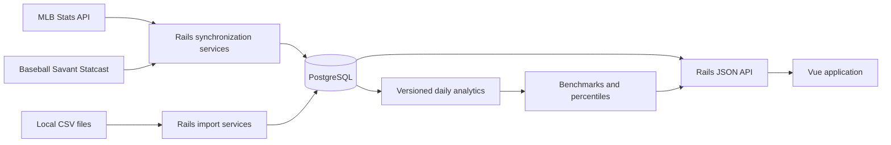

# NineLens

[](https://github.com/sponsors/timothyf)

NineLens is an open-source baseball intelligence platform combining schedules, rosters, player profiles, box scores, season stats, and Statcast data into searchable player and team profiles, leaderboards, trends, benchmarks, game analysis, situational insights, and side-by-side comparisons—built for deeper research and better decisions.

## Support

If you find this project useful, you can support its development via GitHub Sponsors.

The current application version is recorded in [`VERSION`](VERSION). See [`CHANGELOG.md`](CHANGELOG.md) for release history and [`RELEASING.md`](RELEASING.md) for the signed-tag release process.

## Current Features

### Home Dashboard

- A daily MLB briefing built from the application's stored data, using the local `America/Detroit` date.
- Today's games with status, scores, venue, probable pitchers, and links to Game Summary and Team Profile pages.
- Current-season batting leaders (OPS, AVG, Batting WAR, home runs, and RBI) and pitching leaders (Pitching WAR, wins, ERA, and strikeouts), each showing the top five qualified players.
- An All MLB/American League/National League filter for the leader cards, with direct links to Player Profiles and Stat Explorer.
- League pulse cards for the best records, run differential, and recent team form.
- Dataset freshness metadata so users can see when the briefing was last updated.

### Stat Explorer

- Batting and pitching leaderboards with season, team, player, category, sorting, and pagination controls.
- A sortable season column and shareable filter state stored in the URL.
- Player name autocomplete and robust player search that links directly to profiles.
- A separate pitch-data mode so large Statcast queries are loaded only when requested.
- The legacy `/stat-board` URL redirects to `/explore`.

### Player Profiles

- MLB biography, handedness, primary and secondary positions, jersey number, headshot, and current roster status.
- Transaction-aware current and historical organization tenures, with adjacent same-team membership windows consolidated into one timeline entry.
- Career batting or pitching table with one row per season and a career-total row.
- Recent batter and pitcher Statcast indicators.
- Full-season, trailing 7-, 14-, and 30-day, and custom date-range analysis.
- Equal-length previous-period comparisons.
- Selectable rolling windows of 25, 50, or 100 plate appearances and 50, 100, or 250 pitches.
- Trend charts for exit velocity, hard-hit rate, pitch velocity, pitch usage, whiff rate, and chase rate.
- MLB, position, and pitcher-role averages; player percentiles; period-over-period changes; and sample sizes.
- A comparison workspace for two or three players, with aligned season and career totals, profile-loading feedback, saved comparison links, and comparison notes.
- Comparison tables show an overall 0–100 score for each player. Scores use sensible default stat weights, normalize batting counting statistics such as HR, 2B, 3B, RBI, and SO per at-bat, and can be recalculated with user-adjustable weights from Settings. Retired-player comparisons show career totals only.

### Team Profiles

- MLB team directory with logos and dedicated team pages.
- Season selector, record, runs scored and allowed, run differential, recent results, and upcoming games.
- A Team Performance Dashboard with rank-scaled offensive and pitching cards across all 30 teams.
- A sortable all-MLB Team Stats tab with Hitting and Pitching views; the current team is highlighted. The profile summary includes team AVG, ERA, and HR with league ranks.
- Recent-form windows, home/road performance, platoon splits, starter/bullpen results, one-run games, strengths, and concerns.
- Drill-down links to relevant games and players plus tracked plate-appearance and pitch totals.
- Current 40-man and active roster views with links to player profiles.
- Analytics-coverage warnings and roster, schedule, and synchronization freshness metadata.

### Game Summary and Schedules

- Idempotent MLB schedule synchronization with canonical games, teams, venues, probable pitchers, raw responses, and synchronization timestamps.
- Filters for team, date range, season, status, and game type.
- Box-score and live-feed synchronization for batting lines, pitching lines, lineups, substitutions, and plate appearances.
- Statcast pitch linkage by MLB game and at-bat identifiers.
- Clickable game results throughout the application that open a tabbed Game Summary page.
- A persistent scoreboard plus six analytical views:
  - **Overview** — game insights, pitcher decisions, key performers, scoring timeline, and line score.
  - **Box Score** — team batting and pitching lines, MLB-style batting/pitching detail notes, and links to Player Profiles. The header also identifies the official MLB game ID.
  - **Pitching Analysis** — strike, first-pitch strike, whiff, CSW, chase, velocity, batters faced, times-through-order, and pitch-arsenal metrics for every pitcher.
  - **Batted Ball** — team and leading-hitter exit velocity, hard-hit rate, launch angle, expected wOBA, barrels, and contact distribution.
  - **Situational** — RISP, two-out, bases-loaded, leadoff, pinch-hit, high-leverage, batting-order-trip, and turning-point results.
  - **Play-by-Play** — every plate appearance grouped by inning, with expandable pitch counts, pitch type, velocity, outcome, contact measurements, and score progression.
- Game detail responses supporting the drill-down from game to player line to plate appearance to pitch.
- Support for incomplete, postponed, suspended, and doubleheader schedule data.

### Rosters and Profiles

- MLB player-profile synchronization for biographies, handedness, positions, and headshots.
- 40-man roster synchronization for all MLB teams, either league, or one team.
- Historical `TeamMembership` records as the roster source of truth, with normalized roster and injured-list states.
- Independent dated snapshots of both active and 40-man rosters without modifying membership history.

### Derived Analytics

- Incrementally refreshed, calculation-versioned daily summaries for player batting, player pitching, pitcher pitch type, batter splits, pitcher splits, and team metrics.
- Cached contextual MLB, position, and pitcher-role benchmarks.
- Player percentiles, sample sizes, prior-period values, and changes.
- Read-only benchmark calculation for uncached custom player date ranges.

### Acquisition Workflow

- Private watchlists with notes, reusable organizational need profiles, weighted calculated acquisition fit, candidate discovery filters, and similar alternatives.
- Acquisition candidates support assignment to a staff owner, rationale, estimated cost, availability, concerns, and an audited review pipeline from initial review through contact or no longer pursuing.
- Watchlist and need-profile ownership is enforced per user, with audit history for changes and fit recalculations.

### Saved Views and Analyses

- Named saved views are available for Stat Explorer filters, player comparisons, team dashboard tabs and seasons, acquisition discovery searches, and player date-range analyses.
- Every saved analysis stores normalized state plus a canonical in-app URL so it can be reopened with the same filters, players, dates, rolling windows, and dashboard context.
- Sharing controls support private, organization-wide, and public-link visibility. Owners can change sharing or delete their named views; administrators can manage all views.

### Notes and Tags

- Attributed, dated staff notes can be attached to players, games, plate appearances, individual pitches, player comparisons, lineup scenarios, and acquisition candidates.
- Reusable organization-wide tags provide consistent classification across note targets.
- Every edit and archive creates an immutable note revision with editor, timestamp, body, date, and tag snapshot.
- Lineup and acquisition notes inherit their parent resource ownership rules; other baseball-intelligence notes are visible to authenticated staff.

### Accounts and Access

- Account registration, sign-in, sign-out, bearer-token sessions, and current-user lookup.
- Roles include administrator, analyst, coach, scout, and viewer. Legacy `admin` and `editor` values remain supported for compatibility.
- Watchlists require a signed-in user. Admin pages and Admin APIs require an administrator role.
- The frontend hides Watchlists for signed-out users and Admin for signed-out or non-administrator users; backend authorization remains authoritative.
- Sign-ins, imports, workflow changes, and background task starts are attributed in audit history.
- Saved lineup scenarios and opponent reports are private to their owner; administrators can oversee all records. Their direct APIs and team-profile summaries enforce the same policy, and creation or edits are attributed in audit history.

### Trend Events and Alerts

- Persisted alerts for velocity loss, pitch-mix changes, chase-rate movement, and related signals.
- Events include severity, threshold, onset date, sample size, and supporting pitches; positive changes use green improvement styling.

### Data Administration

The `/admin` page centralizes the application's data operations:

- A keyboard-accessible tabbed interface for **Download & Import**, **Operational Tasks**, and **Local File Imports**.
- Download or import player season statistics and Statcast pitches.
- Synchronize MLB schedules, game details, player profiles, and 40-man rosters.
- Synchronize MLB transaction histories used to reconstruct Player Profile team tenures.
- Track game-detail progress in real time, recover active progress after a page reload, and cancel safely between games.
- Capture dated active and 40-man roster snapshots.
- Rebuild normalized current player positions.
- Inspect currently stored date or season coverage for each major dataset.
- Run or reopen the latest Data Health report for missing schedules, incomplete games, player/profile gaps, finished games without linked or completed pitch data, pitch-linkage issues, and analytics coverage.
- View PostgreSQL storage details: total size, largest tables, data/index footprints, estimated live/dead rows, server version, and measurement time.
- View PostgreSQL table-read activity: total, sequential, and index scans; rows read/fetched; last scan timestamps; and the statistics collection start time.
- Every Admin synchronization, analytics refresh, download, and local CSV import runs through a persisted Solid Queue task with queued/running/completed/failed/cancelled status, progress polling, and orphaned-worker recovery.
- Local CSV files are staged durably before enqueueing and removed after the worker completes; a browser request no longer has to remain open while parsing or importing.
- Background task records consistently include the initiating user, timestamps, progress, completion summary, and surfaced error/result details.

## Architecture



## Tech Stack

- Backend: Ruby 3.2.3, Rails 7.1.6, PostgreSQL, Solid Queue, RSpec 6.1, and SeedFu
- Frontend: Vue 3.5, Vue Router 4.6, Vite 8, Vitest 4, and Vue Test Utils
- Sources:
  - MLB Stats API for schedules, games, box scores, live feeds, teams, rosters, profiles, and season statistics
  - Baseball Savant for Statcast pitch-by-pitch data

## Project Structure

- `backend/` — Rails API, data models, synchronization/import services, queries, jobs, Rake tasks, migrations, and specs
- `frontend/` — Vue routes, views, components, composables, styles, and tests
- `docs/` — project requirements and expansion plans

## Local Setup

Prerequisites: Ruby 3.2.3, PostgreSQL, and Node.js 20.19+ (or 22.12+).

### Backend

```bash
cd backend
bundle install
bin/rails db:prepare
bin/rails server
```

The Rails API runs at `http://127.0.0.1:3000` by default. Use `backend/.ruby-version` to select the expected Ruby version.
In development, Puma also starts the Solid Queue worker used by tracked Admin tasks.

After pulling migrations, run `bin/rails db:migrate` before starting the API. Pending migrations prevent Rails from serving API requests, including login and the Home briefing.

For production, run the durable job worker as a separate process:

```bash
cd backend
bin/jobs start
```

Alternatively, set `SOLID_QUEUE_IN_PUMA=1` to run it with Puma.

### Frontend

In a second terminal:

```bash
cd frontend
npm install
npm run dev
```

The Vite development server proxies `/api` requests to `http://127.0.0.1:3000`. To use a different API origin:

```bash
VITE_API_BASE_URL=http://127.0.0.1:3000 npm run dev
```

The main frontend routes are:

- `/` — daily MLB Home dashboard
- `/schedule` — season schedule browser
- `/standings` — current MLB standings
- `/explore` — Stat Explorer for season and Statcast leaderboards
- `/stat-board` — legacy redirect to Stat Explorer
- `/games/:id` — tabbed Game Summary and pitch-level analysis
- `/players/:id` — unified Player Profile
- `/compare` — two- or three-player season and career comparison
- `/saved/:id` — redirect to an accessible saved analysis
- `/teams` — MLB Team Directory
- `/teams/:id` — analytical Team Profile
- `/admin` — imports, synchronization, data health, analytics, and database information
- `/watchlists` — private watchlists, acquisition fit, candidate discovery, and audit history (signed-in users only)
- `/login` — account sign-in and workspace registration

## Recommended Data Workflow

Source imports and MLB synchronization are available from the Admin page. The complete command-line workflow, including derived analytics, is:

1. Synchronize schedules and canonical games.
2. Synchronize game details and plate appearances.
3. Download season statistics and Statcast pitches.
4. Synchronize 40-man rosters, player profiles, and MLB transaction histories.
5. Refresh daily analytics and contextual benchmarks.

All synchronization tasks are designed to be repeatable and idempotent.

### Schedules

```bash
cd backend
bin/rails 'mlb_schedule:sync[2026-04-01,2026-04-30]'
```

Optional controls:

```bash
GAME_TYPES=R SPORT_ID=1 bin/rails 'mlb_schedule:sync[2026-04-01,2026-04-30]'
```

### Game Details

Synchronize stored games within a date range:

```bash
bin/rails 'mlb_game_details:sync[2026-04-01,2026-04-07]'
```

Or refresh one game by its MLB game id:

```bash
MLB_GAME_ID=823443 bin/rails mlb_game_details:sync
```

### Player Season Statistics

Download and import batting or pitching statistics:

```bash
bin/rails 'player_stats:download[batting,2025,2026]'
bin/rails 'player_stats:download[pitching,2025,2026]'
```

Replace existing rows for each requested season and category:

```bash
REPLACE_SEASON=1 bin/rails 'player_stats:download[batting,2025,2026]'
```

Import a local CSV:

```bash
bin/rails 'player_stats:seed[/absolute/path/to/player_season_stats.csv]'
# or
PLAYER_STATS_CSV=/absolute/path/to/player_season_stats.csv bin/rails player_stats:seed
```

Reseed stat types and reimport the preferred local CSV:

```bash
bin/rails player_stats:reimport
```

Verify or repair historical team assignments against MLB source data:

```bash
bin/rails 'player_stats:verify_team_ids[pitching,1968,1968]'
FIX=1 bin/rails 'player_stats:verify_team_ids[pitching,1968,1968]'
```

### Statcast Pitch Data

Download and import from Baseball Savant:

```bash
bin/rails 'pitch_data:download[2026-04-01,2026-04-07]'
```

Optional controls:

```bash
GAME_TYPES=R CHUNK_DAYS=7 bin/rails 'pitch_data:download[2026-04-01,2026-04-30]'
```

Import a local CSV:

```bash
bin/rails 'pitch_data:import[/absolute/path/to/mlb_pitch_data.csv]'
# or
PITCH_DATA_CSV=/absolute/path/to/mlb_pitch_data.csv bin/rails pitch_data:import
```

Statcast pitch data is available from 2008 onward. Large ranges are downloaded in chunks. Imported pitches are linked to canonical games by `game_pk` and to plate appearances when matching game and at-bat data exists.

### Rosters and Player Profiles

Synchronize a team's normal 40-man roster through the end of a past season or through today for the current season:

```bash
bin/rails 'mlb_roster:sync[116,2026]'
```

Capture independent active and 40-man snapshots for a particular date:

```bash
bin/rails 'mlb_roster_snapshots:sync[116,2026-07-15]'
```

Synchronize missing player profiles:

```bash
bin/rails mlb_player_profiles:sync
```

Useful profile controls:

```bash
ONLY_MISSING=false BATCH_SIZE=50 LIMIT=100 bin/rails mlb_player_profiles:sync
MLB_IDS=592450,680776 bin/rails mlb_player_profiles:sync
```

### Daily Analytics and Context

Refresh derived daily summaries after importing game or pitch data:

```bash
bin/rails 'daily_analytics:refresh[2026-04-01,2026-04-30]'
```

Refresh cached benchmarks and player percentiles:

```bash
bin/rails 'contextual_benchmarks:refresh[2026-04-01,2026-04-30]'
```

Set `VERSION` to calculate a separate analytics version:

```bash
VERSION=1.1.0 bin/rails 'daily_analytics:refresh[2026-04-01,2026-04-30]'
```

## API Overview

### Players and Teams

- `GET /api/home` — current daily briefing, games, league leaders, team pulse, and freshness metadata; accepts `league=american|national` for league-specific leaders
- `GET /api/players` — searchable, paginated player directory data
- `GET /api/players/:id` — unified profile, career history, roster history, analysis, trends, and benchmarks
- `GET /api/teams`
- `GET /api/teams/:id` — team profile, performance dashboard, schedule, freshness, and active/40-man rosters
- `GET /api/standings` — current MLB standings
- `GET /api/positions`

Player analysis parameters include `range=season|7|14|30|custom`, `start_date`, `end_date`, `pa_window`, and `pitch_window`.

### Games, Schedules, and Rosters

- `GET /api/games`
- `GET /api/games/:id` — scoreboard, official MLB game ID, insights, key performers, line/box scores, MLB-style box-score and game detail notes, pitching and batted-ball analysis, situational results, and pitch-level play-by-play
- `GET /api/games/upcoming`
- `GET /api/schedules/:id`
- `GET /api/roster_snapshots`
- `GET /api/team_memberships/active_today`
- `GET /api/team_memberships/active_range`
- `GET /api/team_memberships/roster_status`

Game filters include team, start/end date, season, status, and game type. Collection endpoints support pagination where applicable.

### Statistics and Imports

- `GET /api/player_season_stats`
- `POST /api/player_season_stats/import`
- `POST /api/player_season_stats/download`
- `GET /api/pitch_data`
- `POST /api/pitch_data/import`
- `POST /api/pitch_data/download`

Import and download writes require an authenticated administrator or the configured system Admin API token. They return `202 Accepted` with a persisted task run; clients can poll `GET /api/admin/task_runs/:id` for progress and the final result. The application records an attributed `import_started` audit event.

### Authentication and Private Resources

- `POST /api/auth/register` — create the first workspace account; subsequent account creation requires an administrator
- `POST /api/auth/login` — issue a bearer-token session
- `GET /api/auth/me` — return the current signed-in user
- `DELETE /api/auth/logout` — revoke the current session token
- `GET /api/watchlists` and `GET /api/watchlists/:id` — owned watchlists (administrators can view all)
- `GET /api/watchlists/:id/audit_history` — attributed watchlist and entry changes
- `POST /api/watchlist_entries/:id/transition` — advance an owned candidate through the review workflow
- `GET /api/watchlist_entries/:id/audit_history` — review candidate status and evaluation changes
- `GET /api/users` — active staff available for candidate assignment
- `GET /api/need_profiles` — owned need profiles (administrators can view all)
- `GET /api/teams/:team_id/opponent_reports` and `GET /api/opponent_reports/:id` — owned opponent reports
- `PATCH /api/opponent_reports/:id` and `GET /api/opponent_reports/:id/audit_history` — edit and review attributed report history
- `GET /api/teams/:team_id/lineup_scenarios` and `GET /api/lineup_scenarios/:id` — owned lineup scenarios
- `PATCH /api/lineup_scenarios/:id` and `GET /api/lineup_scenarios/:id/audit_history` — edit and review attributed scenario history
- `GET /api/saved_analyses?analysis_type=...` — list saved analyses visible to the current user
- `POST /api/saved_analyses` — save a named analysis with state, visibility, and a reproducible URL
- `PATCH /api/saved_analyses/:id` and `DELETE /api/saved_analyses/:id` — manage an owned saved analysis
- `GET /api/saved_analyses/:id` — resolve an accessible saved analysis; public links use `/saved/:id`
- `GET /api/notes?target_type=...&target_id=...` and `POST /api/notes` — list and create attributed notes
- `PATCH /api/notes/:id`, `DELETE /api/notes/:id`, and `GET /api/notes/:id/history` — edit, archive, and inspect immutable note history
- `GET /api/tags` and `POST /api/tags` — list and create reusable note tags

Send a session token as `Authorization: Bearer <user-session-token>`. The system Admin API token remains available for operational automation and maps to the system administrator account.

### Admin Tasks

- `GET /api/admin/users` — list user accounts, roles, status, and last sign-in
- `PATCH /api/admin/users/:id` — assign a role or disable/enable an account
- `POST /api/admin/users/:id/reset_access` — revoke sessions and issue a one-time temporary password
- `GET /api/admin/tasks` — task catalog plus dataset coverage and database metrics
- `POST /api/admin/tasks/:task_name/run` — enqueue an allowed synchronization or analytics task (compatibility route)
- `GET /api/admin/task_runs` — recent tracked task executions
- `GET /api/admin/task_runs/:id` — current task progress and result details
- `GET /api/admin/task_runs/estimate` — estimate a supported task before starting it
- `POST /api/admin/task_runs` — start a tracked background task
- `POST /api/admin/task_runs/:id/cancel` — request safe cancellation
- `GET /api/admin/data_health` — run the data-health evaluation; the Admin page retains the current report until the user explicitly refreshes it

All Admin endpoints require an authenticated administrator or the configured system Admin API token.

## Admin API Token

Unsafe API requests are protected when `ADMIN_API_TOKEN` is set. In production, unsafe requests fail closed unless this token is configured.

Accepted request headers:

```text
Authorization: Bearer <token>
X-Admin-Token: <token>
```

Set the matching frontend value as `VITE_ADMIN_API_TOKEN` so Admin page imports, downloads, and tasks can authenticate:

```bash
ADMIN_API_TOKEN=your-local-token bin/rails server
VITE_ADMIN_API_TOKEN=your-local-token npm run dev
```

## Tests

Backend:

```bash
cd backend
bundle exec rspec
```

Frontend:

```bash
cd frontend
npm run test:run
```

Production frontend build:

```bash
cd frontend
npm run build
```

The request, service, query, model, composable, component, and view suites cover both normal workflows and important incomplete-data/error states.

## Data Model Notes

- `TeamMembership` is the historical source of truth for a player's team and roster status over time.
- `RosterSnapshot` preserves a source roster exactly as observed on a date and does not replace membership history.
- `players.team_id` represents the current team cache and should agree with the active membership when one exists.
- `games.mlb_id` and `pitch_data.game_pk` identify the same MLB game; `pitch_data.game_id` provides the canonical database relationship.
- `PlateAppearance` is the game-level event boundary; linked `PitchDatum` records provide count, pitch, movement, velocity, contact, and win-probability context.
- Game batting and pitching lines retain upstream season-rate context for accurate AVG, OPS, ERA, and WHIP display.
- Derived daily summaries are calculation-versioned and feed team dashboards, player trends, and contextual benchmarks.
- Raw upstream responses, source names or URLs, and synchronization timestamps are retained by synchronization models where available.
